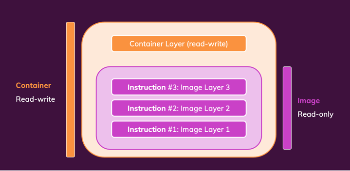

# Section 03. 데이터 관리 및 볼륨으로 작업하기

## 데이터 카테고리 / 다양한 종류의 데이터 이해하기

### Data?

애플리케이션(코드 + 환경) 
- 개발자가 작성 및 제공 
- 빌드 단계에서 이미지 및 컨테이너에 추가 
- 이미지가 빌드된 후에는 변경할 수 없음 
- RO

임시 앱 데이터(예: 사용자 입력)
- 실행 중인 컨테이너에서 생성
- 메모리 또는 임시 파일에 저장
- 동적이며 변경되지만 정기적으로 삭제됨
- RW, 임시이므로 컨테이너에 저장됨

영구 앱 데이터(예: 입력된 사용자 계정)
- 가져오기 실행 중인 컨테이너에서 생성
- 파일 또는 데이터베이스에 저장
- 컨테이너가 다시 시작 혹은 중지해도 손실되어서는 안 됨
- RW, 영구, 컨테이너 및 볼륨과 함께 저장
